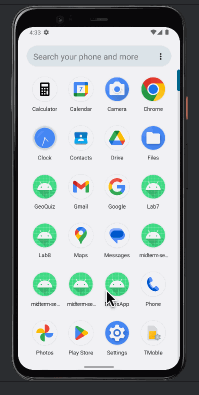

# Android Notes App

A feature-rich note-taking application with user authentication and complete note management functionality.

## Description

This Android application provides a seamless note-taking experience with secure Firebase Authentication. Users can log in to access their notes, view them in a clean list interface, and perform all essential note management operations through an intuitive UI.

## Functionality

The app includes these core features:
- Secure user authentication via Firebase
- Comprehensive notes listing using RecyclerView
- Full CRUD operations (Create, Read, Update, Delete)
- Intuitive note editor with title and description fields
- Confirmation dialogs for deletion to prevent accidents
- Persistent data storage using local database

## Extensions

- Polished UI with Material Design components
- Background threading for smooth performance
- Transition animations for improved UX
- Form validation to ensure data quality
- Automatic timestamps for better note organization

## Video Walkthrough

Here's a demonstration of the app's core functionality:

This walkthrough showcases:
- The authentication process
- Adding new notes with the floating action button
- Viewing and editing existing notes
- The delete confirmation workflow
- Seamless navigation between screens
- Data persistence across sessions

## Notes

- Login credentials are managed through Firebase Authentication
- Asynchronous operations ensure UI responsiveness
- The app architecture follows MVVM design patterns
- Optimized RecyclerView implementation for smooth scrolling
- Standard Android design patterns used throughout

## License

This project is licensed under the MIT License - see the LICENSE file for details.